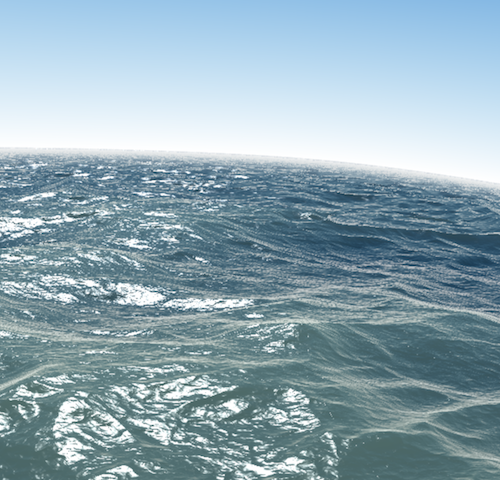

# elm-webgl-playground

## Shadertoy.elm

Renders the shader code from [https://www.shadertoy.com/view/Ms2SD1](https://www.shadertoy.com/view/Ms2SD1) using Elm WebGL.

## CSS3d.elm

Mixes WebGL and DOM layers in one common 3D space.

The front face of the cube is rendered with a transparent color. This makes
a part of the canvas transparent so the DOM element can be seen through it.

Native module had to be used in order to extract the values from `Mat4`.

## Tangram.elm

Elm tangram pieces in 3D, composing different logos of Elm-related projects.

## Animation2D.elm

I couldn't find any simple example of how to render 2D
with WebGL and Elm, so I decided to create this myself.

This renders an animated object at the mouse position:

Special thanks to [Kolja](https://github.com/kolja) for the awesome illustration.  
Please check our WebGL game [Elm Street 404](https://github.com/zalando/elm-street-404).

## Copter3D.elm

I found a copter model, that we had modeled together with a schoolmate using just pen and paper when we were kids back in 2002. This used to be rendered with Direct3D in Visual Basic. I converted the model into Elm and WebGL.

## Planet3D.elm

Generates a planet with randomized surface. In this demo I also tried to add lightning to the scene.

## Instructions to run

1. Install elm [elm-lang.org/install](http://elm-lang.org/install)
2. Clone this repo and `cd` into it
3. Run `elm reactor`
4. Open [localhost:8000](http://localhost:8000) in the browser
